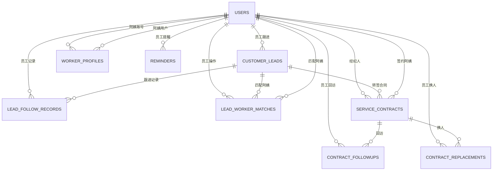
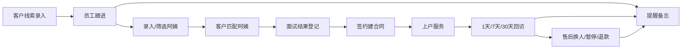

# 后台菜单 + 页面结构 + 表之间关系图

## 一、目标定位

这套后台最终不是单纯的“阿姨展示后台”，而是：

- 老板端：看经营、管员工、看合同、看回访、看提醒
- 员工端：录客户、跟客户、录阿姨、匹配阿姨、签约后回访售后

对应 Excel 的 5 张表，需要在后台里拆成 5 组业务模块。

## 二、建议后台菜单

### 1. 工作台

- 今日新增线索
- 待跟进客户
- 可接单阿姨数
- 服务中合同数
- 今日待回访
- 今日待提醒

### 2. 员工管理

- 员工列表
- 新建员工
- 员工详情
- 员工权限

### 3. 客户线索

- 线索列表
- 新建线索
- 线索详情
- 跟进记录

### 4. 阿姨管理

- 阿姨档案列表
- 新建阿姨档案
- 阿姨详情
- 编辑阿姨档案

### 5. 匹配面试

- 匹配记录列表
- 为客户推荐阿姨
- 面试结果登记

### 6. 合同管理

- 合同列表
- 新建合同
- 合同详情
- 换人记录

### 7. 回访售后

- 待回访列表
- 回访记录
- 售后记录

### 8. 提醒备忘

- 我的提醒
- 团队提醒
- 新建提醒

### 9. 用户管理

- 用户列表

## 三、页面结构

```text
工作台
├─ 经营概览
├─ 今日待办
└─ 关键提醒

员工管理
├─ 员工列表
├─ 新建员工
├─ 员工详情
└─ 权限配置

客户线索
├─ 线索列表
├─ 新建线索
├─ 线索详情
│  ├─ 基础信息
│  ├─ 跟进记录
│  ├─ 匹配记录
│  └─ 关联合同
└─ 跟进日历

阿姨管理
├─ 阿姨列表
├─ 新建阿姨
├─ 阿姨详情
│  ├─ 基础资料
│  ├─ 接单偏好
│  ├─ 证件材料
│  ├─ 服务区域
│  └─ 历史匹配/历史合同
└─ 编辑阿姨

匹配面试
├─ 匹配记录列表
├─ 客户匹配阿姨
└─ 面试结果登记

合同管理
├─ 合同列表
├─ 新建合同
├─ 合同详情
│  ├─ 客户信息
│  ├─ 阿姨信息
│  ├─ 金额信息
│  ├─ 回访记录
│  └─ 售后换人
└─ 换人记录

回访售后
├─ 待回访
├─ 回访记录
└─ 售后处理

提醒备忘
├─ 我的提醒
├─ 团队提醒
└─ 新建提醒
```

## 四、Excel 到后台模块映射

| Excel 表 | 后台模块 | 核心数据表 |
|---|---|---|
| 客户登记表 | 客户线索 | `customer_leads`, `lead_follow_records` |
| 阿姨登记表 | 阿姨管理 | `worker_profiles`, `users` |
| 已面试客户登记表 | 匹配面试 | `lead_worker_matches` |
| 已签客户登记表 | 合同管理 + 回访售后 | `service_contracts`, `contract_followups`, `contract_replacements` |
| 备忘录 | 提醒备忘 | `reminders` |

## 五、表之间关系图



## 六、业务流转图



## 七、实施优先级建议

### 第一优先级

- 客户线索
- 阿姨管理增强
- 匹配面试

### 第二优先级

- 合同管理
- 回访售后

### 第三优先级

- 提醒备忘
- 经营统计看板

## 八、最重要的取舍建议

现在最值得优先做的不是继续扩“用户管理”，而是尽快补齐：

1. 客户线索
2. 阿姨匹配
3. 合同台账

这三块一旦补齐，Excel 就只剩少量备忘用途，老板和员工的日常工作就能逐步迁到后台。
